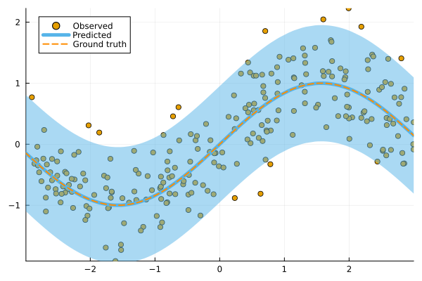
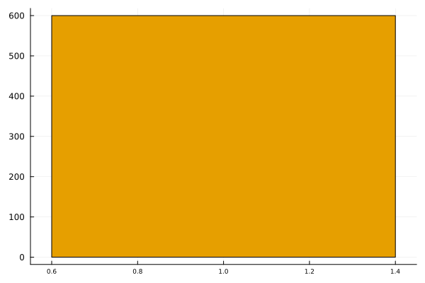

# ConformalPrediction

[](https://pat-alt.github.io/ConformalPrediction.jl/stable/) [](https://pat-alt.github.io/ConformalPrediction.jl/dev/) [](https://github.com/pat-alt/ConformalPrediction.jl/actions/workflows/CI.yml?query=branch%3Amain) [](https://codecov.io/gh/pat-alt/ConformalPrediction.jl) [](https://github.com/invenia/BlueStyle) [](https://github.com/SciML/ColPrac) [](https://twitter.com/paltmey)

`ConformalPrediction.jl` is a package for Uncertainty Quantification (UQ) through Conformal Prediction (CP) in Julia. It is designed to work with supervised models trained in [MLJ](https://alan-turing-institute.github.io/MLJ.jl/dev/) (Blaom et al. 2020). Conformal Prediction is distribution-free, easy-to-understand, easy-to-use and model-agnostic.

## 🏃 Quick Tour

> First time here? Take a quick interactive [tour](https://binder.plutojl.org/v0.19.12/open?url=https%253A%252F%252Fraw.githubusercontent.com%252Fpat-alt%252FConformalPrediction.jl%252Fmain%252Fdocs%252Fpluto%252Fquick_tour%252Fnotebook.jl) to see what this package can do.

The [link](https://binder.plutojl.org/v0.19.12/open?url=https%253A%252F%252Fraw.githubusercontent.com%252Fpat-alt%252FConformalPrediction.jl%252Fmain%252Fdocs%252Fpluto%252Fquick_tour%252Fnotebook.jl) takes you to a `Pluto.jl` notebook hosted on binder.org. In my own experience, this may take a while to load, certainly enough time to get yourself a hot beverage ☕. Alternatively, you can run the notebook locally or skip the tour for now and read on below.

### Local Tour

To run the tour locally, just clone this repo start `Pluto.jl` as follows:

``` julia
] add Pluto
using Pluto
Pluto.run()
```

All notebooks are contained in `docs/pluto`.

## 📖 Background

Conformal Prediction is a scalable frequentist approach to uncertainty quantification and coverage control. It promises to be an easy-to-understand, distribution-free and model-agnostic way to generate statistically rigorous uncertainty estimates. Interestingly, it can even be used to complement Bayesian methods.

The animation below is lifted from a small blog post that introduces the topic and the package (\[[TDS](https://towardsdatascience.com/conformal-prediction-in-julia-351b81309e30)\], \[[Quarto](https://www.paltmeyer.com/blog/posts/conformal-prediction/#fig-anim)\]). It shows conformal prediction sets for two different samples and changing coverage rates. Standard conformal classifiers produce set-valued predictions: for ambiguous samples these sets are typically large (for high coverage) or empty (for low coverage).


## 🚩 Installation

You can install the latest stable release from the general registry:

``` julia
using Pkg
Pkg.add("ConformalPrediction")
```

The development version can be installed as follows:

``` julia
using Pkg
Pkg.add(url="https://github.com/pat-alt/ConformalPrediction.jl")
```

## 🔍 Usage Example

To illustrate the intended use of the package, let’s have a quick look at a simple regression problem. We first generate some synthetic data and then determine indices for our training and test data using [MLJ](https://alan-turing-institute.github.io/MLJ.jl/dev/):

``` julia
using MLJ

# Inputs:
N = 600
xmax = 3.0
using Distributions
d = Uniform(-xmax, xmax)
X = rand(d, N)
X = reshape(X, :, 1)

# Outputs:
noise = 0.5
fun(X) = X * sin(X)
ε = randn(N) .* noise
y = @.(fun(X)) + ε
y = vec(y)

# Partition:
train, test = partition(eachindex(y), 0.4, 0.4, shuffle=true)
```

We then import a decision-tree based regressor ([`EvoTrees.jl`](https://github.com/Evovest/EvoTrees.jl)) following the standard [MLJ](https://alan-turing-institute.github.io/MLJ.jl/dev/) procedure.

``` julia
EvoTreeRegressor = @load EvoTreeRegressor pkg=EvoTrees
model = EvoTreeRegressor(rounds=100) 
```

To turn our conventional model into a conformal model, we just need to declare it as such by using `conformal_model` wrapper function. The generated conformal model instance can wrapped in data to create a *machine*. Finally, we proceed by fitting the machine on training data using the generic `fit!` method:

``` julia
using ConformalPrediction
conf_model = conformal_model(model; method=:jackknife_plus)
mach = machine(conf_model, X, y)
fit!(mach, rows=train)
```

Predictions can then be computed using the generic `predict` method. The code below produces predictions for the first `n` samples. Each tuple contains the lower and upper bound for the prediction interval.

``` julia
show_first = 5
Xtest = selectrows(X, test)
ytest = y[test]
ŷ = predict(mach, Xtest)
ŷ[1:show_first]
```

    5-element Vector{Tuple{Float64, Float64}}:
     (0.325476135568554, 2.5420611849529986)
     (-0.8093221495344456, 1.513229072277355)
     (0.24246467414510378, 2.531848511672005)
     (-0.37629465789570005, 1.9144457517084361)
     (-0.5411423339519135, 1.712803571302072)

For simple models like this one, we can call a custom `Plots` recipe on our instance, fit result and data to generate the chart below:

``` julia
using Plots
zoom = -0.5
plt = plot(mach.model, mach.fitresult, Xtest, ytest, zoom=zoom, observed_lab="Test points")
xrange = range(-xmax+zoom,xmax-zoom,length=N)
plot!(plt, xrange, @.(fun(xrange)), lw=1, ls=:dash, colour=:black, label="Ground truth")
```



We can evaluate the conformal model using the standard [MLJ](https://alan-turing-institute.github.io/MLJ.jl/dev/) workflow with a custom performance measure. You can use either `emp_coverage` for the overall empirical coverage (correctness) or `ssc` for the size-stratified coverage rate (adaptiveness).

``` julia
_eval = evaluate!(mach; measure=[emp_coverage, ssc], verbosity=0)
display(_eval)
println("Empirical coverage: $(round(_eval.measurement[1], digits=3))")
println("SSC: $(round(_eval.measurement[2], digits=3))")
```

    PerformanceEvaluation object with these fields:
      measure, operation, measurement, per_fold,
      per_observation, fitted_params_per_fold,
      report_per_fold, train_test_rows
    Extract:
    ┌───────────────────────────────────────────────────────────┬───────────┬───────
    │ measure                                                   │ operation │ meas ⋯
    ├───────────────────────────────────────────────────────────┼───────────┼───────
    │ emp_coverage (generic function with 1 method)             │ predict   │ 0.95 ⋯
    │ size_stratified_coverage (generic function with 1 method) │ predict   │ 0.90 ⋯
    └───────────────────────────────────────────────────────────┴───────────┴───────
                                                                   3 columns omitted

    Empirical coverage: 0.957
    SSC: 0.907

## 🔁 Status

This package is in its early stages of development and therefore still subject to changes to the core architecture and API.

### Implemented Methodologies

The following CP approaches have been implemented:

**Regression**:

- Inductive
- Naive Transductive
- Jackknife
- Jackknife+
- Jackknife-minmax
- CV+
- CV-minmax

**Classification**:

- Inductive (LABEL (Sadinle, Lei, and Wasserman 2019))
- Naive Transductive
- Adaptive Inductive

The package has been tested for the following supervised models offered by [MLJ](https://alan-turing-institute.github.io/MLJ.jl/dev/).

**Regression**:

``` julia
keys(tested_atomic_models[:regression])
```

    KeySet for a Dict{Symbol, Expr} with 5 entries. Keys:
      :nearest_neighbor
      :evo_tree
      :light_gbm
      :linear
      :decision_tree

**Classification**:

``` julia
keys(tested_atomic_models[:classification])
```

    KeySet for a Dict{Symbol, Expr} with 5 entries. Keys:
      :nearest_neighbor
      :evo_tree
      :light_gbm
      :decision_tree
      :logistic

### Implemented Evaluation Metrics

To evaluate conformal predictors we are typically interested in correctness and adaptiveness. The former can be evaluated by looking at the empirical coverage rate, while the latter can be assessed through metrics that address the conditional coverage (Angelopoulos and Bates 2021). To this end, the following metrics have been implemented:

- `emp_coverage` (empirical coverage)
- `ssc` (size-stratified coverage)

There is also a simple `Plots.jl` recipe that can be used to inspect the set sizes. In the regression case, the interval width is stratified into discrete bins for this purpose:

``` julia
bar(mach.model, mach.fitresult, X)
```



## 🛠 Contribute

Contributions are welcome! A good place to start is the [list](https://github.com/pat-alt/ConformalPrediction.jl/issues) of outstanding issues. For more details, see also the [Contributor’s Guide](https://www.paltmeyer.com/ConformalPrediction.jl/dev/contribute/). Please follow the [SciML ColPrac guide](https://github.com/SciML/ColPrac).

## 🙏 Thanks

To build this package we have made heavy use of this amazing [tutorial](https://arxiv.org/abs/2107.07511) (Angelopoulos and Bates 2021) and also this research [paper](https://arxiv.org/abs/1905.02928). The Awesome Conformal Prediction [repository](https://github.com/valeman/awesome-conformal-prediction) (Manokhin, n.d.) has also been a fantastic place to get started. Special thanks also to [@aangelopoulos](https://github.com/aangelopoulos), [@valeman](https://github.com/valeman) and others for actively contributing to discussions on here. Finally, many thanks to Anthony Blaom ([@ablaom](https://github.com/ablaom)) for many helpful discussions about how to interface this package to `MLJ.jl`.

## 🎓 References

Angelopoulos, Anastasios N., and Stephen Bates. 2021. “A Gentle Introduction to Conformal Prediction and Distribution-Free Uncertainty Quantification.” <https://arxiv.org/abs/2107.07511>.

Blaom, Anthony D., Franz Kiraly, Thibaut Lienart, Yiannis Simillides, Diego Arenas, and Sebastian J. Vollmer. 2020. “MLJ: A Julia Package for Composable Machine Learning.” *Journal of Open Source Software* 5 (55): 2704. <https://doi.org/10.21105/joss.02704>.

Manokhin, Valery. n.d. “Awesome Conformal Prediction.”

Sadinle, Mauricio, Jing Lei, and Larry Wasserman. 2019. “Least Ambiguous Set-Valued Classifiers with Bounded Error Levels.” *Journal of the American Statistical Association* 114 (525): 223–34.
