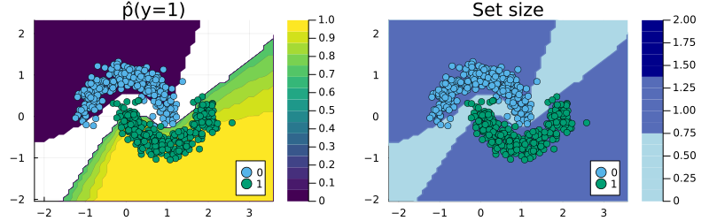

# Classification

``` @meta
CurrentModule = ConformalPrediction
```

This tutorial is based in parts on this [blog post](https://www.paltmeyer.com/blog/posts/conformal-prediction/).

### Split Conformal Classification

We consider a simple binary classification problem. Let (*X*_(*i*),*Y*_(*i*)), *i* = 1, ..., *n* denote our feature-label pairs and let *μ* : 𝒳 ↦ 𝒴 denote the mapping from features to labels. For illustration purposes we will use the moons dataset 🌙. Using [`MLJ.jl`](https://alan-turing-institute.github.io/MLJ.jl/v0.18/) we first generate the data and split into into a training and test set:

``` julia
using MLJ
using Random
Random.seed!(123)

# Data:
X, y = make_moons(500; noise=0.15)
train, test = partition(eachindex(y), 0.8, shuffle=true)
```

Here we will use a specific case of CP called *split conformal prediction* which can then be summarized as follows:[1]

1.  Partition the training into a proper training set and a separate calibration set: 𝒟_(*n*) = 𝒟^(train) ∪ 𝒟^(cali).
2.  Train the machine learning model on the proper training set: *μ̂*_(*i* ∈ 𝒟^(train))(*X*_(*i*),*Y*_(*i*)).
3.  Compute nonconformity scores, 𝒮, using the calibration data 𝒟^(cali) and the fitted model *μ̂*_(*i* ∈ 𝒟^(train)).
4.  For a user-specified desired coverage ratio (1−*α*) compute the corresponding quantile, *q̂*, of the empirical distribution of nonconformity scores, 𝒮.
5.  For the given quantile and test sample *X*_(test), form the corresponding conformal prediction set:

*C*(*X*_(test)) = {*y* : *s*(*X*_(test),*y*) ≤ *q̂*}   (1)

This is the default procedure used for classification and regression in [`ConformalPrediction.jl`](https://github.com/pat-alt/ConformalPrediction.jl).

Now let’s take this to our 🌙 data. To illustrate the package functionality we will demonstrate the envisioned workflow. We first define our atomic machine learning model following standard [`MLJ.jl`](https://alan-turing-institute.github.io/MLJ.jl/v0.18/) conventions. Using [`ConformalPrediction.jl`](https://github.com/pat-alt/ConformalPrediction.jl) we then wrap our atomic model in a conformal model using the standard API call `conformal_model(model::Supervised; kwargs...)`. To train and predict from our conformal model we can then rely on the conventional [`MLJ.jl`](https://alan-turing-institute.github.io/MLJ.jl/v0.18/) procedure again. In particular, we wrap our conformal model in data (turning it into a machine) and then fit it on the training set. Finally, we use our machine to predict the label for a new test sample `Xtest`:

``` julia
# Model:
KNNClassifier = @load KNNClassifier pkg=NearestNeighborModels
model = KNNClassifier(;K=50) 

# Training:
using ConformalPrediction
conf_model = conformal_model(model; coverage=.9)
mach = machine(conf_model, X, y)
fit!(mach, rows=train)

# Conformal Prediction:
Xtest = selectrows(X, first(test))
ytest = y[first(test)]
predict(mach, Xtest)[1]
```

    import NearestNeighborModels ✔

               UnivariateFinite{Multiclass{2}}      
         ┌                                        ┐ 
       0 ┤■■■■■■■■■■■■■■■■■■■■■■■■■■■■■■■■■■ 0.94   
         └                                        ┘ 

The final predictions are set-valued. While the softmax output remains unchanged for the `SimpleInductiveClassifier`, the size of the prediction set depends on the chosen coverage rate, (1−*α*).

When specifying a coverage rate very close to one, the prediction set will typically include many (in some cases all) of the possible labels. Below, for example, both classes are included in the prediction set when setting the coverage rate equal to (1−*α*)=1.0. This is intuitive, since high coverage quite literally requires that the true label is covered by the prediction set with high probability.

``` julia
conf_model = conformal_model(model; coverage=coverage)
mach = machine(conf_model, X, y)
fit!(mach, rows=train)

# Conformal Prediction:
Xtest = (x1=[1],x2=[0])
predict(mach, Xtest)[1]
```

               UnivariateFinite{Multiclass{2}}      
         ┌                                        ┐ 
       0 ┤■■■■■■■■■■■■■■■■■■■■■■■■■■■■■■■■■■■ 0.5   
       1 ┤■■■■■■■■■■■■■■■■■■■■■■■■■■■■■■■■■■■ 0.5   
         └                                        ┘ 

Conversely, for low coverage rates, prediction sets can also be empty. For a choice of (1−*α*)=0.1, for example, the prediction set for our test sample is empty. This is a bit difficult to think about intuitively and I have not yet come across a satisfactory, intuitive interpretation.[2] When the prediction set is empty, the `predict` call currently returns `missing`:

``` julia
conf_model = conformal_model(model; coverage=coverage)
mach = machine(conf_model, X, y)
fit!(mach, rows=train)

# Conformal Prediction:
predict(mach, Xtest)[1]
```

    missing

``` julia
cov_ = .9
conf_model = conformal_model(model; coverage=cov_)
mach = machine(conf_model, X, y)
fit!(mach, rows=train)
Markdown.parse("""
The following chart shows the resulting predicted probabilities for ``y=1`` (left) and set size (right) for a choice of ``(1-\\alpha)``=$cov_.
""")
```

The following chart shows the resulting predicted probabilities for *y* = 1 (left) and set size (right) for a choice of (1−*α*)=0.9.

``` julia
using Plots
p_proba = plot(mach.model, mach.fitresult, X, y)
p_set_size = plot(mach.model, mach.fitresult, X, y; plot_set_size=true)
plot(p_proba, p_set_size, size=(800,250))
```



The animation below should provide some more intuition as to what exactly is happening here. It illustrates the effect of the chosen coverage rate on the predicted softmax output and the set size in the two-dimensional feature space. Contours are overlayed with the moon data points (including test data). The two samples highlighted in red, *X*₁ and *X*₂, have been manually added for illustration purposes. Let’s look at these one by one.

Firstly, note that *X*₁ (red cross) falls into a region of the domain that is characterized by high predictive uncertainty. It sits right at the bottom-right corner of our class-zero moon 🌜 (orange), a region that is almost entirely enveloped by our class-one moon 🌛 (green). For low coverage rates the prediction set for *X*₁ is empty: on the left-hand side this is indicated by the missing contour for the softmax probability; on the right-hand side we can observe that the corresponding set size is indeed zero. For high coverage rates the prediction set includes both *y* = 0 and *y* = 1, indicative of the fact that the conformal classifier is uncertain about the true label.

With respect to *X*₂, we observe that while also sitting on the fringe of our class-zero moon, this sample populates a region that is not fully enveloped by data points from the opposite class. In this region, the underlying atomic classifier can be expected to be more certain about its predictions, but still not highly confident. How is this reflected by our corresponding conformal prediction sets?

``` julia
Xtest_2 = (x1=[-0.5],x2=[0.25])
p̂_2 = pdf(predict(mach, Xtest_2)[1], 0)
```

Well, for low coverage rates (roughly  \< 0.9) the conformal prediction set does not include *y* = 0: the set size is zero (right panel). Only for higher coverage rates do we have *C*(*X*₂) = {0}: the coverage rate is high enough to include *y* = 0, but the corresponding softmax probability is still fairly low. For example, for (1−*α*) = 0.9 we have *p̂*(*y*=0|*X*₂) = 0.72.

These two examples illustrate an interesting point: for regions characterized by high predictive uncertainty, conformal prediction sets are typically empty (for low coverage) or large (for high coverage). While set-valued predictions may be something to get used to, this notion is overall intuitive.

``` julia
# Setup
coverages = range(0.75,1.0,length=5)
n = 100
x1_range = range(extrema(X.x1)...,length=n)
x2_range = range(extrema(X.x2)...,length=n)

anim = @animate for coverage in coverages
    conf_model = conformal_model(model; coverage=coverage)
    mach = machine(conf_model, X, y)
    fit!(mach, rows=train)
    # Probabilities:
    p1 = plot(mach.model, mach.fitresult, X, y)
    scatter!(p1, Xtest.x1, Xtest.x2, ms=6, c=:red, label="X₁", shape=:cross, msw=6)
    scatter!(p1, Xtest_2.x1, Xtest_2.x2, ms=6, c=:red, label="X₂", shape=:diamond, msw=6)
    p2 = plot(mach.model, mach.fitresult, X, y; plot_set_size=true)
    scatter!(p2, Xtest.x1, Xtest.x2, ms=6, c=:red, label="X₁", shape=:cross, msw=6)
    scatter!(p2, Xtest_2.x1, Xtest_2.x2, ms=6, c=:red, label="X₂", shape=:diamond, msw=6)
    plot(p1, p2, plot_title="(1-α)=$(round(coverage,digits=2))", size=(800,300))
end

gif(anim, joinpath(www_path,"classification.gif"), fps=1)
```

The effect of the coverage rate on the conformal prediction set. Softmax probabilities are shown on the left. The size of the prediction set is shown on the right.


[1] In other places split conformal prediction is sometimes referred to as *inductive* conformal prediction.

[2] Any thoughts/comments welcome!
