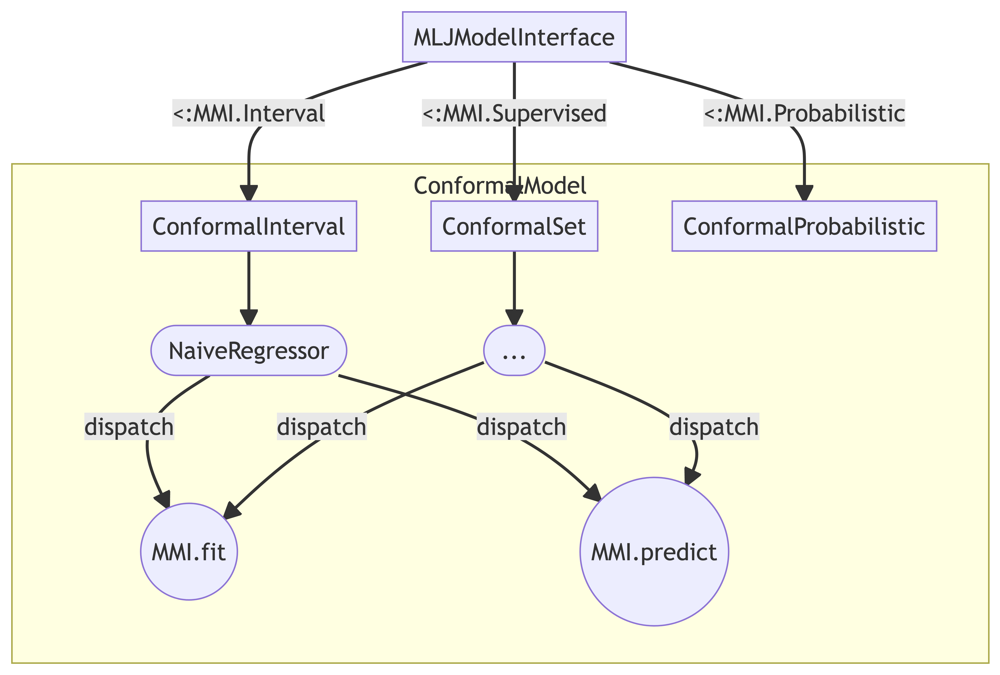

# Contributor’s Guide

``` @meta
CurrentModule = ConformalPrediction
```

## Contents

``` @contents
Pages = ["contribute.md"]
Depth = 2
```

## Contributing to `ConformalPrediction.jl`

Contributions are welcome! Please follow the [SciML ColPrac guide](https://github.com/SciML/ColPrac).

## Architecture

The diagram below demonstrates the package architecture at the time of writing. This is still subject to change, so any thoughts and comments are very much welcome.

The goal is to make this package as compatible as possible with MLJ to tab into existing functionality. The basic idea is to subtype MLJ `Supervised` models and then use concrete types to implement different approaches to conformal prediction. For each of these concrete types the compulsory `MMI.fit` and `MMI.predict` methods need be implemented (see [here](https://alan-turing-institute.github.io/MLJ.jl/v0.18/adding_models_for_general_use/#Supervised-models)).



### Abstract Suptypes

Currently I intend to work with three different abstract subtypes:

``` @docs
ConformalInterval
ConformalSet
ConformalProbabilistic
```

### `fit` and `predict`

The `fit` and `predict` methods are compulsory in order to prepare models for general use with MLJ. They also serve us to implement the logic underlying the various approaches to conformal prediction.

To understand how this currently works, let’s look at the [`AdaptiveInductiveClassifier`](@ref) as an example. Below are the two docstrings documenting both methods. Hovering over the bottom-right corner will reveal buttons that take

``` @docs
fit(conf_model::AdaptiveInductiveClassifier, verbosity, X, y)
```

``` @docs
predict(conf_model::AdaptiveInductiveClassifier, fitresult, Xnew)
```
