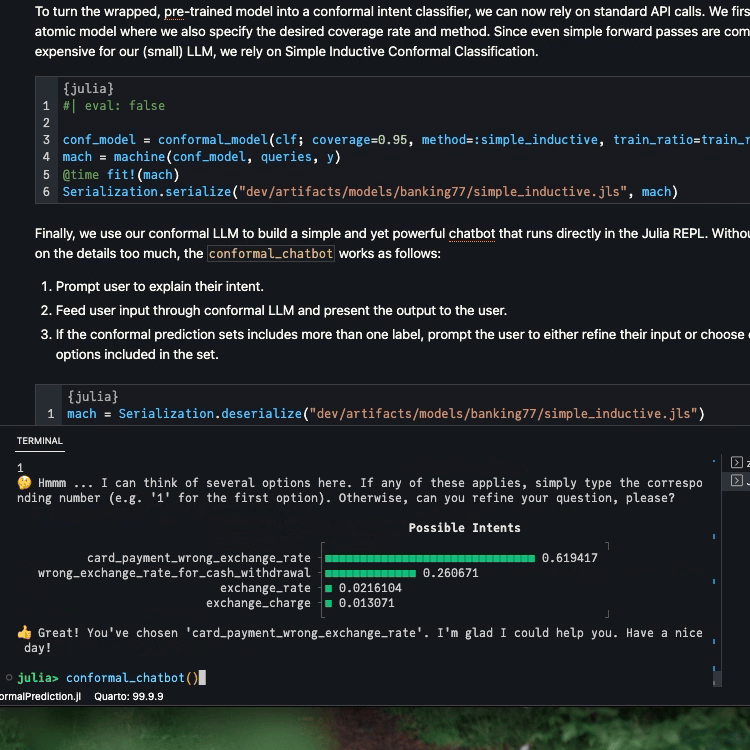

# How to Build a Conformal Chatbot

Large Language Models are all the buzz right now. They are used for a variety of tasks, including text classification, question answering, and text generation. In this tutorial, we will show how to conformalize a transformer language model for text classification. We will use the [Banking77](https://arxiv.org/abs/2003.04807) dataset (Casanueva et al. 2020), which consists of 13,083 queries from 77 intents. On the model side, we will use the [DistilRoBERTa](https://huggingface.co/mrm8488/distilroberta-finetuned-banking77) model, which is a distilled version of [RoBERTa](https://arxiv.org/abs/1907.11692) (Liu et al. 2019) finetuned on the Banking77 dataset.

## Data

The data was downloaded from [HuggingFace](https://huggingface.co/datasets/PolyAI/banking77) 🤗 (HF) and split into a proper training, calibration, and test set. All that’s left to do is to load the data and preprocess it. We add 1 to the labels to make them 1-indexed (sorry Pythonistas 😜)

``` julia
# Get labels:
df_labels = CSV.read("dev/artifacts/data/banking77/labels.csv", DataFrame, drop=[1])
labels = df_labels[:,1]

# Get data:
df_train = CSV.read("dev/artifacts/data/banking77/train.csv", DataFrame, drop=[1])
df_cal = CSV.read("dev/artifacts/data/banking77/calibration.csv", DataFrame, drop=[1])
df_full_train = vcat(df_train, df_cal)
train_ratio = round(nrow(df_train)/nrow(df_full_train), digits=2)
df_test = CSV.read("dev/artifacts/data/banking77/test.csv", DataFrame, drop=[1])

# Preprocess data:
queries_train, y_train = collect(df_train.text), categorical(df_train.labels .+ 1)
queries_cal, y_cal = collect(df_cal.text), categorical(df_cal.labels .+ 1)
queries, y = collect(df_full_train.text), categorical(df_full_train.labels .+ 1)
queries_test, y_test = collect(df_test.text), categorical(df_test.labels .+ 1)
```

## HuggingFace Model

The model can be loaded from HF straight into our running Julia session using the [`Transformers.jl`](https://github.com/chengchingwen/Transformers.jl/tree/master) package. Below we load the tokenizer `tkr` and the model `mod`. The tokenizer is used to convert the text into a sequence of integers, which is then fed into the model. The model outputs a hidden state, which is then fed into a classifier to get the logits for each class. Finally, the logits are then passed through a softmax function to get the corresponding predicted probabilities. Below we run a few queries through the model to see how it performs.

``` julia
# Load model from HF 🤗:
tkr = hgf"mrm8488/distilroberta-finetuned-banking77:tokenizer"
mod = hgf"mrm8488/distilroberta-finetuned-banking77:ForSequenceClassification"

# Test model:
query = [
    "What is the base of the exchange rates?",
    "Why is my card not working?",
    "My Apple Pay is not working, what should I do?",
]
a = encode(tkr, query)
b = mod.model(a)
c = mod.cls(b.hidden_state)
d = softmax(c.logit)
[labels[i] for i in Flux.onecold(d)]
```

    3-element Vector{String}:
     "exchange_rate"
     "card_not_working"
     "apple_pay_or_google_pay"

## `MLJ` Interface

Since our package is interfaced to [`MLJ.jl`](https://alan-turing-institute.github.io/MLJ.jl/dev/), we need to define a wrapper model that conforms to the `MLJ` interface. In order to add the model for general use, we would probably go through [`MLJFlux.jl`](https://github.com/FluxML/MLJFlux.jl), but for this tutorial, we will make our life easy and simply overload the `MLJBase.fit` and `MLJBase.predict` methods. Since the model from HF is already pre-trained and we are not interested in further fine-tuning, we will simply return the model object in the `MLJBase.fit` method. The `MLJBase.predict` method will then take the model object and the query and return the predicted probabilities. We also need to define the `MLJBase.target_scitype` and `MLJBase.predict_mode` methods. The former tells `MLJ` what the output type of the model is, and the latter can be used to retrieve the label with the highest predicted probability.

``` julia
struct IntentClassifier <: MLJBase.Probabilistic
    tkr::TextEncoders.AbstractTransformerTextEncoder
    mod::HuggingFace.HGFRobertaForSequenceClassification
end

function IntentClassifier(;
    tokenizer::TextEncoders.AbstractTransformerTextEncoder, 
    model::HuggingFace.HGFRobertaForSequenceClassification,
)
    IntentClassifier(tkr, mod)
end

function get_hidden_state(clf::IntentClassifier, query::Union{AbstractString, Vector{<:AbstractString}})
    token = encode(clf.tkr, query)
    hidden_state = clf.mod.model(token).hidden_state
    return hidden_state
end

# This doesn't actually retrain the model, but it retrieves the classifier object
function MLJBase.fit(clf::IntentClassifier, verbosity, X, y)
    cache=nothing
    report=nothing
    fitresult = (clf = clf.mod.cls, labels = levels(y))
    return fitresult, cache, report
end

function MLJBase.predict(clf::IntentClassifier, fitresult, Xnew)
    output = fitresult.clf(get_hidden_state(clf, Xnew))
    p̂ = UnivariateFinite(fitresult.labels,softmax(output.logit)',pool=missing)
    return p̂
end

MLJBase.target_scitype(clf::IntentClassifier) = AbstractVector{<:Finite}

MLJBase.predict_mode(clf::IntentClassifier, fitresult, Xnew) = mode.(MLJBase.predict(clf, fitresult, Xnew))
```

To test that everything is working as expected, we fit the model and generated predictions for a subset of the test data:

``` julia
clf = IntentClassifier(tkr, mod)
top_n = 10
fitresult, _, _ = MLJBase.fit(clf, 1, nothing, y_test[1:top_n])
@time ŷ = MLJBase.predict(clf, fitresult, queries_test[1:top_n]);
```

## Conformal Chatbot

To turn the wrapped, pre-trained model into a conformal intent classifier, we can now rely on standard API calls. We first wrap our atomic model where we also specify the desired coverage rate and method. Since even simple forward passes are computationally expensive for our (small) LLM, we rely on Simple Inductive Conformal Classification.

``` julia
#| eval: false

conf_model = conformal_model(clf; coverage=0.95, method=:simple_inductive, train_ratio=train_ratio)
mach = machine(conf_model, queries, y)
@time fit!(mach)
Serialization.serialize("dev/artifacts/models/banking77/simple_inductive.jls", mach)
```

Finally, we use our conformal LLM to build a simple and yet powerful chatbot that runs directly in the Julia REPL. Without dwelling on the details too much, the `conformal_chatbot` works as follows:

1.  Prompt user to explain their intent.
2.  Feed user input through conformal LLM and present the output to the user.
3.  If the conformal prediction sets includes more than one label, prompt the user to either refine their input or choose one of the options included in the set.

``` julia
mach = Serialization.deserialize("dev/artifacts/models/banking77/simple_inductive.jls")

function prediction_set(mach, query::String)
    p̂ = MLJBase.predict(mach, query)[1]
    probs = pdf.(p̂, collect(1:77))
    in_set = findall(probs .!= 0)
    labels_in_set = labels[in_set]
    probs_in_set = probs[in_set]
    _order = sortperm(-probs_in_set)
    plt = UnicodePlots.barplot(labels_in_set[_order], probs_in_set[_order], title="Possible Intents")
    return labels_in_set, plt
end

function conformal_chatbot()
    println("👋 Hi, I'm a Julia, your conformal chatbot. I'm here to help you with your banking query. Ask me anything or type 'exit' to exit ...\n")
    completed = false
    queries = ""
    while !completed
        query = readline()
        queries = queries * "," * query
        labels, plt = prediction_set(mach, queries)
        if length(labels) > 1
            println("🤔 Hmmm ... I can think of several options here. If any of these applies, simply type the corresponding number (e.g. '1' for the first option). Otherwise, can you refine your question, please?\n")
            println(plt)
        else
            println("🥳 I think you mean $(labels[1]). Correct?")
        end

        # Exit:
        if query == "exit"
            println("👋 Bye!")
            break
        end
        if query ∈ string.(collect(1:77))
            println("👍 Great! You've chosen '$(labels[parse(Int64, query)])'. I'm glad I could help you. Have a nice day!")
            completed = true
        end
    end
end
```

Below we show the output for two example queries. The first one is very ambiguous. As expected, the size of the prediction set is therefore large.

``` julia
ambiguous_query = "transfer mondey?"
prediction_set(mach, ambiguous_query)[2]
```

                                                            Possible Intents              
                                               ┌                                        ┐ 
                       beneficiary_not_allowed ┤■■■■■■■■■■■■■■■■■■■■■■■■■■■■■■ 0.150517   
       balance_not_updated_after_bank_transfer ┤■■■■■■■■■■■■■■■■■■■■■■ 0.111409           
                         transfer_into_account ┤■■■■■■■■■■■■■■■■■■■ 0.0939535             
            transfer_not_received_by_recipient ┤■■■■■■■■■■■■■■■■■■ 0.091163               
                top_up_by_bank_transfer_charge ┤■■■■■■■■■■■■■■■■■■ 0.089306               
                               failed_transfer ┤■■■■■■■■■■■■■■■■■■ 0.0888322              
                               transfer_timing ┤■■■■■■■■■■■■■ 0.0641952                   
                          transfer_fee_charged ┤■■■■■■■ 0.0361131                         
                              pending_transfer ┤■■■■■ 0.0270795                           
                               receiving_money ┤■■■■■ 0.0252126                           
                             declined_transfer ┤■■■ 0.0164443                             
                               cancel_transfer ┤■■■ 0.0150444                             
                                               └                                        ┘ 

The more refined version of the prompt yields a smaller prediction set: less ambiguous prompts result in lower predictive uncertainty.

``` julia
refined_query = "I tried to transfer money to my friend, but it failed."
prediction_set(mach, refined_query)[2]
```

                                                            Possible Intents              
                                               ┌                                        ┐ 
                               failed_transfer ┤■■■■■■■■■■■■■■■■■■■■■■■■■■■■■■■ 0.59042   
                       beneficiary_not_allowed ┤■■■■■■■ 0.139806                          
            transfer_not_received_by_recipient ┤■■ 0.0449783                              
       balance_not_updated_after_bank_transfer ┤■■ 0.037894                               
                             declined_transfer ┤■ 0.0232856                               
                         transfer_into_account ┤■ 0.0108771                               
                               cancel_transfer ┤ 0.00876369                               
                                               └                                        ┘ 

Below we include a short demo video that shows the REPL-based chatbot in action.



## Final Remarks

This work was done in collaboration with colleagues at ING as part of the ING Analytics 2023 Experiment Week. Our team demonstrated that Conformal Prediction provides a powerful and principled alternative to top-*K* intent classification. We won the first prize by popular vote.

## References

Casanueva, Iñigo, Tadas Temčinas, Daniela Gerz, Matthew Henderson, and Ivan Vulić. 2020. “Efficient Intent Detection with Dual Sentence Encoders.” In *Proceedings of the 2nd Workshop on Natural Language Processing for Conversational AI*, 38–45. Online: Association for Computational Linguistics. <https://doi.org/10.18653/v1/2020.nlp4convai-1.5>.

Liu, Yinhan, Myle Ott, Naman Goyal, Jingfei Du, Mandar Joshi, Danqi Chen, Omer Levy, Mike Lewis, Luke Zettlemoyer, and Veselin Stoyanov. 2019. “RoBERTa: A Robustly Optimized BERT Pretraining Approach.” arXiv. <https://doi.org/10.48550/arXiv.1907.11692>.
