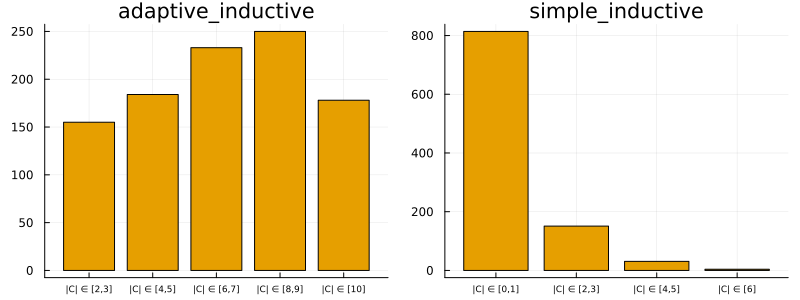

# How to Conformalize a Deep Image Classifier

Deep Learning is popular and — for some tasks like image classification — remarkably powerful. But it is also well-known that Deep Neural Networks (DNN) can be unstable (Goodfellow, Shlens, and Szegedy 2014) and poorly calibrated. Conformal Prediction can be used to mitigate these pitfalls. This how-to guide demonstrates how you can build an image classifier in `Flux.jl` and conformalize its predictions. For a formal treatment see A. Angelopoulos et al. (2022).

## The Task at Hand

The task at hand is to predict the labels of handwritten images of digits using the famous MNIST dataset (LeCun 1998). Importing this popular machine learning dataset in Julia is made remarkably easy through `MLDatasets.jl`:

``` julia
using MLDatasets
N = 1000
Xraw, yraw = MNIST(split=:train)[:]
Xraw = Xraw[:,:,1:N]
yraw = yraw[1:N]
```

The chart below shows a few random samples from the training data:

``` julia
using MLJ
using Images
X = map(x -> convert2image(MNIST, x), eachslice(Xraw, dims=3))
y = coerce(yraw, Multiclass)

n_samples = 10
mosaic(rand(X, n_samples)..., ncol=n_samples)
```


## Building the Network

To model the mapping from image inputs to labels will rely on a simple Multi-Layer Perceptron (MLP). A great Julia library for Deep Learning is `Flux.jl`. But wait … doesn’t `ConformalPrediction.jl` work with models trained in `MLJ.jl`? That’s right, but fortunately there exists a `Flux.jl` interface to `MLJ.jl`, namely `MLJFlux.jl`. The interface is still in its early stages, but already very powerful and easily accessible for anyone (like myself) who is used to building Neural Networks in `Flux.jl`.

In `Flux.jl`, you could build an MLP for this task as follows,

``` julia
using Flux

mlp = Chain(
    Flux.flatten,
    Dense(prod((28,28)), 32, relu),
    Dense(32, 10)
)
```

where `(28,28)` is just the input dimension (28x28 pixel images). Since we have ten digits, our output dimension is ten.[1]

We can do the exact same thing in `MLJFlux.jl` as follows,

``` julia
using MLJFlux

builder = MLJFlux.@builder Chain(
    Flux.flatten,
    Dense(prod(n_in), 32, relu),
    Dense(32, n_out)
)
```

where here we rely on the `@builder` macro to make the transition from `Flux.jl` to `MLJ.jl` as seamless as possible. Finally, `MLJFlux.jl` already comes with a number of helper functions to define plain-vanilla networks. In this case, we will use the `ImageClassifier` with our custom builder and cross-entropy loss:

``` julia
ImageClassifier = @load ImageClassifier
clf = ImageClassifier(
    builder=builder,
    epochs=10,
    loss=Flux.crossentropy
)
```

The generated instance `clf` is a model (in the `MLJ.jl` sense) so from this point on we can rely on standard `MLJ.jl` workflows. For example, we can wrap our model in data to create a machine and then evaluate it on a holdout set as follows:

``` julia
mach = machine(clf, X, y)

evaluate!(
    mach,
    resampling=Holdout(rng=123, fraction_train=0.8),
    operation=predict_mode,
    measure=[accuracy]
)
```

The accuracy of our very simple model is not amazing, but good enough for the purpose of this tutorial. For each image, our MLP returns a softmax output for each possible digit: 0,1,2,3,…,9. Since each individual softmax output is valued between zero and one, *y*_(*k*) ∈ (0,1), this is commonly interpreted as a probability: *y*_(*k*) ≔ *p*(*y*=*k*|*X*). Edge cases – that is values close to either zero or one – indicate high predictive certainty. But this is only a heuristic notion of predictive uncertainty (A. N. Angelopoulos and Bates 2021). Next, we will turn this heuristic notion of uncertainty into a rigorous one using Conformal Prediction.

## Conformalizing the Network

Since `clf` is a model, it is also compatible with our package: `ConformalPrediction.jl`. To conformalize our MLP, we therefore only need to call `conformal_model(clf)`. Since the generated instance `conf_model` is also just a model, we can still rely on standard `MLJ.jl` workflows. Below we first wrap it in data and then fit it. Aaaand … we’re done! Let’s look at the results in the next section.

``` julia
using ConformalPrediction
conf_model = conformal_model(clf; method=:simple_inductive)
mach = machine(conf_model, X, y)
fit!(mach)
```

## Results

The charts below present the results. The first row displays highly certain predictions, now defined in the rigorous sense of Conformal Prediction: in each case, the conformal set (just beneath the image) includes only one label.

The following two rows display increasingly uncertain predictions of set size two and three, respectively. They demonstrate that CP is well equipped to deal with samples characterized by high aleatoric uncertainty: digits four (4), seven (7) and nine (9) share certain similarities. So do digits five (5) and six (6) as well as three (3) and eight (8). These may be hard to distinguish from each other even after seeing many examples (and even for a human). It is therefore unsurprising to see that these digits often end up together in conformal sets.


Conformalized predictions from an image classifier.

## Evaluation

As always, we can also evaluate our conformal model in terms of coverage (correctness) and size-stratified coverage (adaptiveness).

``` julia
_eval = evaluate!(
    mach,
    resampling=Holdout(rng=123, fraction_train=0.8),
    operation=predict,
    measure=[emp_coverage, ssc]
)
display(_eval)
println("Empirical coverage: $(round(_eval.measurement[1], digits=3))")
println("SSC: $(round(_eval.measurement[2], digits=3))")
```

    PerformanceEvaluation object with these fields:
      measure, operation, measurement, per_fold,
      per_observation, fitted_params_per_fold,
      report_per_fold, train_test_rows
    Extract:
    ┌──────────────────────────────────────────────┬───────────┬─────────────┬──────
    │ measure                                      │ operation │ measurement │ per ⋯
    ├──────────────────────────────────────────────┼───────────┼─────────────┼──────
    │ ConformalPrediction.emp_coverage             │ predict   │ 0.96        │ [0. ⋯
    │ ConformalPrediction.size_stratified_coverage │ predict   │ 0.885       │ [0. ⋯
    └──────────────────────────────────────────────┴───────────┴─────────────┴──────
                                                                    1 column omitted

    Empirical coverage: 0.96
    SSC: 0.885

Unsurprisingly, we can attain higher adaptivity (SSC) when using adaptive prediction sets:

``` julia
conf_model = conformal_model(clf; method=:adaptive_inductive)
mach = machine(conf_model, X, y)
fit!(mach)
_eval = evaluate!(
    mach,
    resampling=Holdout(rng=123, fraction_train=0.8),
    operation=predict,
    measure=[emp_coverage, ssc]
)
results[:adaptive_inductive] = mach
display(_eval)
println("Empirical coverage: $(round(_eval.measurement[1], digits=3))")
println("SSC: $(round(_eval.measurement[2], digits=3))")
```

    PerformanceEvaluation object with these fields:
      measure, operation, measurement, per_fold,
      per_observation, fitted_params_per_fold,
      report_per_fold, train_test_rows
    Extract:
    ┌──────────────────────────────────────────────┬───────────┬─────────────┬──────
    │ measure                                      │ operation │ measurement │ per ⋯
    ├──────────────────────────────────────────────┼───────────┼─────────────┼──────
    │ ConformalPrediction.emp_coverage             │ predict   │ 1.0         │ [1. ⋯
    │ ConformalPrediction.size_stratified_coverage │ predict   │ 1.0         │ [1. ⋯
    └──────────────────────────────────────────────┴───────────┴─────────────┴──────
                                                                    1 column omitted

    Empirical coverage: 1.0
    SSC: 1.0

We can also have a look at the resulting set size for both approaches:

``` julia
plt_list = []
for (_mod, mach) in results
    push!(plt_list, bar(mach.model, mach.fitresult, X; title=String(_mod)))
end
plot(plt_list..., size=(800,300))
```



# References

Angelopoulos, Anastasios N., and Stephen Bates. 2021. “A Gentle Introduction to Conformal Prediction and Distribution-Free Uncertainty Quantification.” <https://arxiv.org/abs/2107.07511>.

Angelopoulos, Anastasios, Stephen Bates, Jitendra Malik, and Michael I. Jordan. 2022. “Uncertainty Sets for Image Classifiers Using Conformal Prediction.” arXiv. <https://arxiv.org/abs/2009.14193>.

Goodfellow, Ian J, Jonathon Shlens, and Christian Szegedy. 2014. “Explaining and Harnessing Adversarial Examples.” <https://arxiv.org/abs/1412.6572>.

LeCun, Yann. 1998. “The MNIST Database of Handwritten Digits.”

[1] For a full tutorial on how to build an MNIST image classifier relying solely on `Flux.jl`, check out this [tutorial](https://fluxml.ai/Flux.jl/stable/tutorials/2021-01-26-mlp/).
