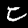

``` @meta
CurrentModule = ConformalPrediction
```

# How to Conformalize an Deep Learning Image Classifier in Five Minutes

Deep Learning is popular and — for some tasks like image classification — remarkably powerful. But it is also well-known that Deep Neural Networks (DNN) can be unstable (Goodfellow, Shlens, and Szegedy 2014) and poorly calibrated. Conformal Prediction can be used to mitigate these pitfalls. This how-to guide demonstrates how you can build an image classifier in `Flux.jl` and conformalize its predictions.

## The Task at Hand

The task at hand is to predict the labels of handwritten images of digits using the famous MNIST dataset (LeCun 1998).

``` julia
using MLDatasets
N = 500
Xraw, yraw = MNIST(split=:train)[:]
Xraw = Xraw[:,:,1:N]
yraw = yraw[1:N]
```

``` julia
using MLJ
X = coerce(Xraw, GrayImage)
y = coerce(yraw, Multiclass)
```

## Building the Network

``` julia
using Flux
using MLJFlux

builder = MLJFlux.@builder Chain(
    Flux.flatten,
    Dense(prod(n_in), 32, relu),
    Dense(32, n_out)
)
```

``` julia
ImageClassifier = @load ImageClassifier
clf = ImageClassifier(
    builder=builder,
    epochs=10,
    loss=Flux.crossentropy
)
```

``` julia
mach = machine(clf, X, y)

evaluate!(
    mach,
    resampling=Holdout(rng=123, fraction_train=0.8),
    operation=predict_mode,
    measure=[accuracy]
)
```

## Conformalizing the Network

``` julia
using ConformalPrediction
conf_model = conformal_model(clf)
mach = machine(conf_model, X, y)
fit!(mach)
```

``` julia
set_sizes = ConformalPrediction.set_size.(predict(mach, X))
candidates = findall(set_sizes .> 1)
chosen = rand(candidates)
display(predict(mach, X[chosen])[1])
display(X[chosen])
```

              UnivariateFinite{Multiclass{10}}      
         ┌                                        ┐ 
       0 ┤■■ 0.0701684                              
       7 ┤■■■■■■■■■■■■■■■■■■■■■■■■■■■■■■ 0.911558   
         └                                        ┘ 



``` julia
_eval = evaluate!(
    mach,
    resampling=Holdout(rng=123, fraction_train=0.8),
    operation=predict,
    measure=[emp_coverage, ssc]
)
println("Empirical coverage: $(round(_eval.measurement[1], digits=3))")
println("SSC: $(round(_eval.measurement[2], digits=3))")
```

## Results

# References

Goodfellow, Ian J, Jonathon Shlens, and Christian Szegedy. 2014. “Explaining and Harnessing Adversarial Examples.” <https://arxiv.org/abs/1412.6572>.

LeCun, Yann. 1998. “The MNIST Database of Handwritten Digits.”
