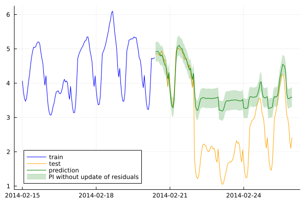
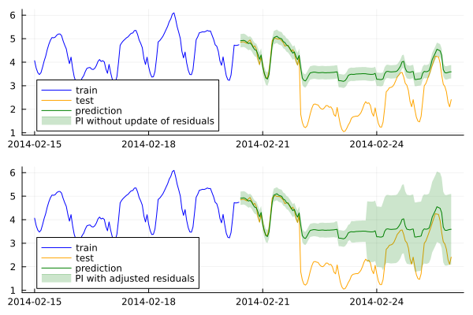

# How to Conformalize a Time Series Model

Time series data is prevalent across various domains, such as finance, weather forecasting, energy, and supply chains. However, accurately quantifying uncertainty in time series predictions is often a complex task due to inherent temporal dependencies, non-stationarity, and noise in the data. In this context, Conformal Prediction offers a valuable solution by providing prediction intervals which offer a sound way to quantify uncertainty.

This how-to guide demonstrates how you can conformalize a time series data using Ensemble Batch Prediction Intervals (EnbPI) (Xu and Xie 2022). This method enables the updating of prediction intervals whenever new observations are available. This dynamic update process allows the method to adapt to changing conditions, accounting for the potential degradation of predictions or the increase in noise levels in the data.

## The Task at Hand

Inspired by [MAPIE](https://mapie.readthedocs.io/en/latest/examples_regression/4-tutorials/plot_ts-tutorial.html), we employ the Victoria electricity demand dataset. This dataset contains hourly electricity demand (in GW) for Victoria state in Australia, along with corresponding temperature data (in Celsius degrees).

``` julia
using CSV, DataFrames
df = CSV.read("./dev/artifacts/electricity_demand.csv", DataFrame)
```

## Feature engineering

In this how-to guide, we only focus on data, time and lag features.

### Date and Time-related features

We create temporal features out of the date and hour:

``` julia
using Dates
df.Datetime = Dates.DateTime.(df.Datetime, "yyyy-mm-dd HH:MM:SS")
df.Weekofyear = Dates.week.(df.Datetime)
df.Weekday = Dates.dayofweek.(df.Datetime)
df.hour = Dates.hour.(df.Datetime) 
```

Additionally, to simulate sudden changes caused by unforeseen events, such as blackouts or lockdowns, we deliberately reduce the electricity demand by 2GW from February 22nd onward.

``` julia
condition = df.Datetime .>= Date("2014-02-22")
df[condition, :Demand] .= df[condition, :Demand] .- 2
```

### Lag features

``` julia
using ShiftedArrays
n_lags = 5
for i = 1:n_lags
    DataFrames.transform!(df, "Demand" => (x -> ShiftedArrays.lag(x, i)) => "lag_hour_$i")
end

df_dropped_missing = dropmissing(df)
df_dropped_missing
```

## Train-test split

``` julia
features_cols = select(df_dropped_missing, Not([:Datetime, :Demand]))
X = Matrix(features_cols)
y = Matrix(df_dropped_missing[:, [:Demand]])
split_index = floor(Int, 0.9 * size(y , 1)) 
println(split_index)
X_train = X[1:split_index, :]
y_train = y[1:split_index, :]
X_test = X[split_index+1 : size(y,1), :]
y_test = y[split_index+1 : size(y,1), :]
```

## Loading model using MLJ interface

``` julia
using MLJ
EvoTreeRegressor = @load EvoTreeRegressor pkg=EvoTrees verbosity=0
model =  EvoTreeRegressor(nrounds =100, max_depth=10, rng=123)
```

## Conformal time series

We start off with using EnbPI without updating training set residuals to build prediction intervals:

``` julia
using ConformalPrediction

conf_model = conformal_model(model; method=:time_series_ensemble_batch, coverage=0.95)
mach = machine(conf_model, X_train, y_train)
train = [1:split_index;]
fit!(mach, rows=train)

y_pred_interval = predict(conf_model, mach.fitresult, X_test)
lb = [ minimum(tuple_data) for tuple_data in y_pred_interval]
ub = [ maximum(tuple_data) for tuple_data in y_pred_interval]
y_pred = [mean(tuple_data) for tuple_data in y_pred_interval]
```



We can use `partial_fit` method in EnbPI implementation in ConformalPrediction in order to adjust prediction intervals to sudden change points on test sets that have not been seen by the model during training. In the below experiment, sample_size indicates the batch of new observations. You can decide if you want to update residuals by sample_size or update and remove first *n* residuals (shift_size = n). The latter will allow to remove early residuals that will not have a positive impact on the current observations.

``` julia
sample_size = 10
shift_size = 10
last_index = size(X_test , 1)
lb_updated , ub_updated = ([], [])
for step in 1:sample_size:last_index
    if last_index - step < sample_size
        y_interval = predict(conf_model, mach.fitresult, X_test[step:last_index , :])
        partial_fit(mach.model , mach.fitresult, X_test[step:last_index , :], y_test[step:last_index , :], shift_size)
    else
        y_interval = predict(conf_model, mach.fitresult, X_test[step:step+sample_size-1 , :])
        partial_fit(mach.model , mach.fitresult, X_test[step:step+sample_size-1 , :], y_test[step:step+sample_size-1 , :], shift_size)        
    end 
    lb_updatedᵢ= [ minimum(tuple_data) for tuple_data in y_interval]
    push!(lb_updated,lb_updatedᵢ)
    ub_updatedᵢ = [ maximum(tuple_data) for tuple_data in y_interval]
    push!(ub_updated, ub_updatedᵢ)
end
lb_updated = reduce(vcat, lb_updated)
ub_updated = reduce(vcat, ub_updated)
```



## Results

In time series problems, unexpected incidents can lead to sudden changes, and such scenarios are highly probable. As illustrated earlier, the model’s training data lacks information about these change points, making it unable to anticipate them. The top figure demonstrates that when residuals are not updated, the prediction intervals solely rely on the distribution of residuals from the training set. Consequently, these intervals fail to encompass the true observations after the change point, resulting in a sudden drop in coverage.

However, by partially updating the residuals, the method becomes adept at capturing the increasing uncertainties in model predictions. It is important to note that the changes in uncertainty occur approximately one day after the change point. This delay is attributed to the requirement of having a sufficient number of new residuals to alter the quantiles obtained from the residual distribution.

## References

Xu, Chen, and Yao Xie. 2022. “Conformal Prediction Set for Time-Series.” arXiv. <https://doi.org/10.48550/arXiv.2206.07851>.
