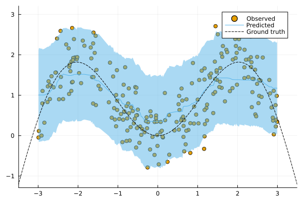
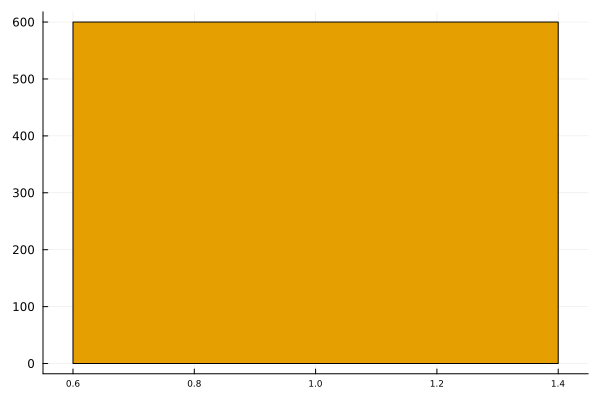

# ConformalPrediction

``` @meta
CurrentModule = ConformalPrediction
```


Documentation for [ConformalPrediction.jl](https://github.com/juliatrustworthyai/ConformalPrediction.jl).

`ConformalPrediction.jl` is a package for Predictive Uncertainty Quantification (UQ) through Conformal Prediction (CP) in Julia. It is designed to work with supervised models trained in [MLJ](https://alan-turing-institute.github.io/MLJ.jl/dev/) (Blaom et al. 2020). Conformal Prediction is easy-to-understand, easy-to-use and model-agnostic and it works under minimal distributional assumptions.

## 🏃 Quick Tour

> First time here? Take a quick interactive [tour](https://juliahub.com/ui/Notebooks/juliahub/Tutorials/ConformalPrediction.jl) to see what this package can do right on [JuliaHub](https://juliahub.com/ui/Notebooks/juliahub/Tutorials/ConformalPrediction.jl) (To run the notebook, hit login and then edit).

This [`Pluto.jl`](https://github.com/fonsp/Pluto.jl) 🎈 notebook won the 2nd Price in the [JuliaCon 2023 Notebook Competition](https://info.juliahub.com/pluto-notebook-winner-23).

### Local Tour

To run the tour locally, just clone this repo and start `Pluto.jl` as follows:

``` julia
] add Pluto
using Pluto
Pluto.run()
```

All notebooks are contained in `docs/pluto`.

## 📖 Background

Don’t worry, we’re not about to deep-dive into methodology. But just to give you a high-level description of Conformal Prediction (CP) upfront:

> Conformal prediction (a.k.a. conformal inference) is a user-friendly paradigm for creating statistically rigorous uncertainty sets/intervals for the predictions of such models. Critically, the sets are valid in a distribution-free sense: they possess explicit, non-asymptotic guarantees even without distributional assumptions or model assumptions.
>
> — Angelopoulos and Bates (2021)

Intuitively, CP works under the premise of turning heuristic notions of uncertainty into rigorous uncertainty estimates through repeated sampling or the use of dedicated calibration data.


The animation above is lifted from a small blog [post](https://www.paltmeyer.com/blog/posts/conformal-regression/) that introduces Conformal Prediction and this package in the context of regression. It shows how the prediction interval and the test points that it covers varies in size as the user-specified coverage rate changes.

## 🚩 Installation

You can install the latest stable release from the general registry:

``` julia
using Pkg
Pkg.add("ConformalPrediction")
```

The development version can be installed as follows:

``` julia
using Pkg
Pkg.add(url="https://github.com/juliatrustworthyai/ConformalPrediction.jl")
```

## 🔍 Usage Example

To illustrate the intended use of the package, let’s have a quick look at a simple regression problem. We first generate some synthetic data and then determine indices for our training and test data using [MLJ](https://alan-turing-institute.github.io/MLJ.jl/dev/):

``` julia
using MLJ

# Inputs:
N = 600
xmax = 3.0
using Distributions
d = Uniform(-xmax, xmax)
X = rand(d, N)
X = reshape(X, :, 1)

# Outputs:
noise = 0.5
fun(X) = sin(X)
ε = randn(N) .* noise
y = @.(fun(X)) + ε
y = vec(y)

# Partition:
train, test = partition(eachindex(y), 0.4, 0.4, shuffle=true)
```

We then import Symbolic Regressor ([`SymbolicRegression.jl`](https://github.com/MilesCranmer/SymbolicRegression.jl)) following the standard [MLJ](https://alan-turing-institute.github.io/MLJ.jl/dev/) procedure.

``` julia
regressor = @load SRRegressor pkg=SymbolicRegression
model = regressor(
    niterations=50,
    binary_operators=[+, -, *],
    unary_operators=[sin],
)
```

To turn our conventional model into a conformal model, we just need to declare it as such by using `conformal_model` wrapper function. The generated conformal model instance can wrapped in data to create a *machine*. Finally, we proceed by fitting the machine on training data using the generic `fit!` method:

``` julia
using ConformalPrediction
conf_model = conformal_model(model)
mach = machine(conf_model, X, y)
fit!(mach, rows=train)
```

Predictions can then be computed using the generic `predict` method. The code below produces predictions for the first `n` samples. Each tuple contains the lower and upper bound for the prediction interval.

``` julia
show_first = 5
Xtest = selectrows(X, test)
ytest = y[test]
ŷ = predict(mach, Xtest)
ŷ[1:show_first]
```

    5-element Vector{Tuple{Float64, Float64}}:
     (-0.04087262272113379, 1.8635644669554758)
     (0.04647464096907805, 1.9509117306456876)
     (-0.24248802236397216, 1.6619490673126376)
     (-0.07841928163933476, 1.8260178080372749)
     (-0.02268628324126465, 1.881750806435345)

For simple models like this one, we can call a custom `Plots` recipe on our instance, fit result and data to generate the chart below:

``` julia
using Plots
zoom = 0
plt = plot(mach.model, mach.fitresult, Xtest, ytest, lw=5, zoom=zoom, observed_lab="Test points")
xrange = range(-xmax+zoom,xmax-zoom,length=N)
plot!(plt, xrange, @.(fun(xrange)), lw=2, ls=:dash, colour=:darkorange, label="Ground truth")
```



We can evaluate the conformal model using the standard [MLJ](https://alan-turing-institute.github.io/MLJ.jl/dev/) workflow with a custom performance measure. You can use either `emp_coverage` for the overall empirical coverage (correctness) or `ssc` for the size-stratified coverage rate (adaptiveness).

``` julia
_eval = evaluate!(mach; measure=[emp_coverage, ssc], verbosity=0)
display(_eval)
println("Empirical coverage: $(round(_eval.measurement[1], digits=3))")
println("SSC: $(round(_eval.measurement[2], digits=3))")
```

    PerformanceEvaluation object with these fields:
      model, measure, operation, measurement, per_fold,
      per_observation, fitted_params_per_fold,
      report_per_fold, train_test_rows, resampling, repeats
    Extract:
    ┌──────────────────────────────────────────────┬───────────┬─────────────┬──────
    │ measure                                      │ operation │ measurement │ 1.9 ⋯
    ├──────────────────────────────────────────────┼───────────┼─────────────┼──────
    │ ConformalPrediction.emp_coverage             │ predict   │ 0.953       │ 0.0 ⋯
    │ ConformalPrediction.size_stratified_coverage │ predict   │ 0.953       │ 0.0 ⋯
    └──────────────────────────────────────────────┴───────────┴─────────────┴──────
                                                                   2 columns omitted

    Empirical coverage: 0.953
    SSC: 0.953

## 📚 Read on

If after reading the usage example above you are just left with more questions about the topic, that’s normal. Below we have have collected a number of further resources to help you get started with this package and the topic itself:

1.  Blog post introducing conformal classifiers: \[[Quarto](https://www.paltmeyer.com/blog/posts/conformal-prediction/)\], \[[TDS](https://medium.com/towards-data-science/conformal-prediction-in-julia-351b81309e30)\], \[[Forem](https://forem.julialang.org/patalt/conformal-prediction-in-julia-h9n)\].
2.  Blog post applying CP to a deep learning image classifier: \[[Quarto](https://www.paltmeyer.com/blog/posts/conformal-image-classifier/)\], \[[TDS](https://medium.com/towards-data-science/how-to-conformalize-a-deep-image-classifier-14ead4e1a5a0)\], \[[Forem](https://forem.julialang.org/patalt/how-to-conformalize-a-deep-image-classifier-50p2)\].
3.  The package [docs](https://juliatrustworthyai.github.io/ConformalPrediction.jl/dev/) and in particular the [FAQ](https://www.paltmeyer.com/ConformalPrediction.jl/dev/faq/).

### External Resources

- *A Gentle Introduction to Conformal Prediction and Distribution-Free Uncertainty Quantification* by Angelopoulos and Bates (2021) ([pdf](https://arxiv.org/pdf/2107.07511.pdf)).
- *Predictive inference with the jackknife+* by Barber et al. (2021) ([pdf](https://projecteuclid.org/journals/annals-of-statistics/volume-49/issue-1/Predictive-inference-with-the-jackknife/10.1214/20-AOS1965.full))
- *Awesome Conformal Prediction* repository by Valery Manokhin ([repo](https://github.com/valeman/awesome-conformal-prediction)).
- [Documentation](https://mapie.readthedocs.io/en/latest/index.html) for the Python package MAPIE.

## 🔁 Status

This package is in its early stages of development and therefore still subject to changes to the core architecture and API.

### Implemented Methodologies

The following CP approaches have been implemented:

**Regression**:

- Inductive
- Naive Transductive
- Jackknife
- Jackknife+
- Jackknife-minmax
- CV+
- CV-minmax

**Classification**:

- Inductive
- Naive Transductive
- Adaptive Inductive

The package has been tested for the following supervised models offered by [MLJ](https://alan-turing-institute.github.io/MLJ.jl/dev/).

**Regression**:

``` julia
keys(tested_atomic_models[:regression])
```

    KeySet for a Dict{Symbol, Expr} with 5 entries. Keys:
      :ridge
      :lasso
      :evo_tree
      :nearest_neighbor
      :linear

**Classification**:

``` julia
keys(tested_atomic_models[:classification])
```

    KeySet for a Dict{Symbol, Expr} with 3 entries. Keys:
      :nearest_neighbor
      :evo_tree
      :logistic

### Implemented Evaluation Metrics

To evaluate conformal predictors we are typically interested in correctness and adaptiveness. The former can be evaluated by looking at the empirical coverage rate, while the latter can be assessed through metrics that address the conditional coverage (Angelopoulos and Bates 2021). To this end, the following metrics have been implemented:

- `emp_coverage` (empirical coverage)
- `ssc` (size-stratified coverage)

There is also a simple `Plots.jl` recipe that can be used to inspect the set sizes. In the regression case, the interval width is stratified into discrete bins for this purpose:

``` julia
bar(mach.model, mach.fitresult, X)
```



## 🛠 Contribute

Contributions are welcome! A good place to start is the [list](https://github.com/juliatrustworthyai/ConformalPrediction.jl/issues) of outstanding issues. For more details, see also the [Contributor’s Guide](https://www.paltmeyer.com/ConformalPrediction.jl/dev/contribute/). Please follow the [SciML ColPrac guide](https://github.com/SciML/ColPrac).

## 🙏 Thanks

To build this package I have read and re-read both Angelopoulos and Bates (2021) and Barber et al. (2021). The Awesome Conformal Prediction [repository](https://github.com/valeman/awesome-conformal-prediction) (Manokhin, n.d.) has also been a fantastic place to get started. Thanks also to [@aangelopoulos](https://github.com/aangelopoulos), [@valeman](https://github.com/valeman) and others for actively contributing to discussions on here. Quite a few people have also recently started using and contributing to the package for which I am very grateful. Finally, many thanks to Anthony Blaom ([@ablaom](https://github.com/ablaom)) for many helpful discussions about how to interface this package to `MLJ.jl`.

## 🎓 References

Angelopoulos, Anastasios N., and Stephen Bates. 2021. “A Gentle Introduction to Conformal Prediction and Distribution-Free Uncertainty Quantification.” <https://arxiv.org/abs/2107.07511>.

Barber, Rina Foygel, Emmanuel J. Candès, Aaditya Ramdas, and Ryan J. Tibshirani. 2021. “Predictive Inference with the Jackknife+.” *The Annals of Statistics* 49 (1): 486–507. <https://doi.org/10.1214/20-AOS1965>.

Blaom, Anthony D., Franz Kiraly, Thibaut Lienart, Yiannis Simillides, Diego Arenas, and Sebastian J. Vollmer. 2020. “MLJ: A Julia Package for Composable Machine Learning.” *Journal of Open Source Software* 5 (55): 2704. <https://doi.org/10.21105/joss.02704>.

Manokhin, Valery. n.d. “Awesome Conformal Prediction.”
