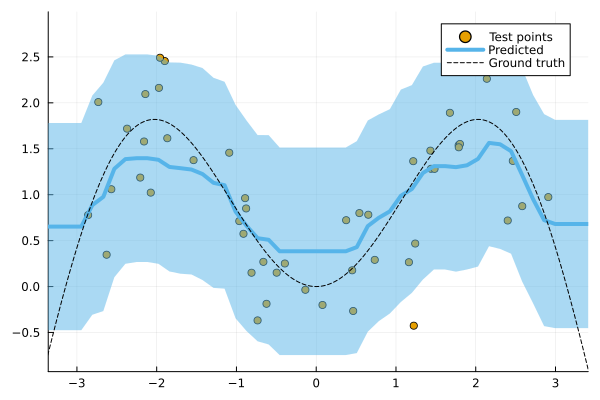

``` @meta
CurrentModule = ConformalPrediction
```

# ConformalPrediction

Documentation for [ConformalPrediction.jl](https://github.com/pat-alt/ConformalPrediction.jl).

`ConformalPrediction.jl` is a package for Uncertainty Quantification (UQ) through Conformal Prediction (CP) in Julia. It is designed to work with supervised models trained in [MLJ](https://alan-turing-institute.github.io/MLJ.jl/dev/) Blaom et al. (2020). Conformal Prediction is distribution-free, easy-to-understand, easy-to-use and model-agnostic.

# 📖 Background

Conformal Prediction is a scalable frequentist approach to uncertainty quantification and coverage control. It promises to be an easy-to-understand, distribution-free and model-agnostic way to generate statistically rigorous uncertainty estimates. Interestingly, it can even be used to complement Bayesian methods.

The animation below is lifted from a small blog post that introduces the topic and the package (\[[TDS](https://towardsdatascience.com/conformal-prediction-in-julia-351b81309e30)\], \[[Quarto](https://www.paltmeyer.com/blog/posts/conformal-prediction/#fig-anim)\]). It shows conformal prediction sets for two different samples and changing coverage rates. Standard conformal classifiers produce set-valued predictions: for ambiguous samples these sets are typically large (for high coverage) or empty (for low coverage).


## 🚩 Installation

You can install the latest stable release from the general registry:

``` julia
using Pkg
Pkg.add("ConformalPrediction")
```

The development version can be installed as follows:

``` julia
using Pkg
Pkg.add(url="https://github.com/pat-alt/ConformalPrediction.jl")
```

## 🔁 Status

This package is in its early stages of development and therefore still subject to changes to the core architecture and API. The following CP approaches have been implemented in the development version:

**Regression**:

- Inductive
- Naive Transductive
- Jackknife
- Jackknife+
- Jackknife-minmax
- CV+
- CV-minmax

**Classification**:

- Inductive (LABEL (Sadinle, Lei, and Wasserman 2019))
- Adaptive Inductive

The package has been tested for the following supervised models offered by [MLJ](https://alan-turing-institute.github.io/MLJ.jl/dev/).

**Regression**:

``` julia
using ConformalPrediction
keys(tested_atomic_models[:regression])
```

    KeySet for a Dict{Symbol, Expr} with 5 entries. Keys:
      :nearest_neighbor
      :evo_tree
      :light_gbm
      :linear
      :decision_tree

**Classification**:

``` julia
keys(tested_atomic_models[:classification])
```

    KeySet for a Dict{Symbol, Expr} with 5 entries. Keys:
      :nearest_neighbor
      :evo_tree
      :light_gbm
      :decision_tree
      :logistic

## 🔍 Usage Example

To illustrate the intended use of the package, let’s have a quick look at a simple regression problem. Using [MLJ](https://alan-turing-institute.github.io/MLJ.jl/dev/) we first generate some synthetic data and then determine indices for our training, calibration and test data:

``` julia
using MLJ

# Inputs:
N = 600
xmax = 3.0
using Distributions
d = Uniform(-xmax, xmax)
X = rand(d, N)
X = reshape(X, :, 1)

# Outputs:
noise = 0.5
fun(X) = X * sin(X)
ε = randn(N) .* noise
y = @.(fun(X)) + ε
y = vec(y)

# Partition:
train, test = partition(eachindex(y), 0.4, 0.4, shuffle=true)
```

We then import a decision tree ([`EvoTrees.jl`](https://github.com/Evovest/EvoTrees.jl)) following the standard [MLJ](https://alan-turing-institute.github.io/MLJ.jl/dev/) procedure.

``` julia
EvoTreeRegressor = @load EvoTreeRegressor pkg=EvoTrees
model = EvoTreeRegressor(rounds=100) 
```

To turn our conventional model into a conformal model, we just need to declare it as such by using `conformal_model` wrapper function. The generated conformal model instance can wrapped in data to create a *machine*. Finally, we proceed by fitting the machine on training data using the generic `fit!` method:

``` julia
using ConformalPrediction
conf_model = conformal_model(model; method=:jackknife_plus)
mach = machine(conf_model, X, y)
fit!(mach, rows=train)
```

Predictions can then be computed using the generic `predict` method. The code below produces predictions for the first `n` samples. Each tuple contains the lower and upper bound for the prediction interval. The chart below visualizes the results.

``` julia
show_first = 5
Xtest = selectrows(X, test)
ytest = y[test]
ŷ = predict(mach, Xtest)
ŷ[1:show_first]
```

    ╭───────────────────────────────────────────────────────────╮
    │                                                           │
    │      (1)   (0.43551526547848046, 2.6332057068681665)      │
    │      (2)   (0.2549311529001698, 2.51442447285207)         │
    │      (3)   (0.013595617761448903, 2.2354822319945615)     │
    │      (4)   (0.4575537084523473, 2.677558088410297)        │
    │      (5)   (0.5163658290099347, 2.6967957385843824)       │
    │                                                           │
    │                                                           │
    ╰─────────────────────────────────────────────── 5 items ───╯



We can evaluate the conformal model using the standard [MLJ](https://alan-turing-institute.github.io/MLJ.jl/dev/) workflow with a custom performance measure (either `emp_coverage` for the overall empirical coverage or `ssc` for the size-stratified coverage rate).

``` julia
_eval = evaluate!(mach; measure=[emp_coverage, ssc], verbosity=0)
println("Empirical coverage: $(round(_eval.measurement[1], digits=3))")
println("SSC: $(round(_eval.measurement[2], digits=3))")
```

    Empirical coverage: 0.95
    SSC: 0.815

## 🛠 Contribute

Contributions are welcome! Please follow the [SciML ColPrac guide](https://github.com/SciML/ColPrac).

## 🎓 References

Blaom, Anthony D., Franz Kiraly, Thibaut Lienart, Yiannis Simillides, Diego Arenas, and Sebastian J. Vollmer. 2020. “MLJ: A Julia Package for Composable Machine Learning.” *Journal of Open Source Software* 5 (55): 2704. <https://doi.org/10.21105/joss.02704>.

Sadinle, Mauricio, Jing Lei, and Larry Wasserman. 2019. “Least Ambiguous Set-Valued Classifiers with Bounded Error Levels.” *Journal of the American Statistical Association* 114 (525): 223–34.
