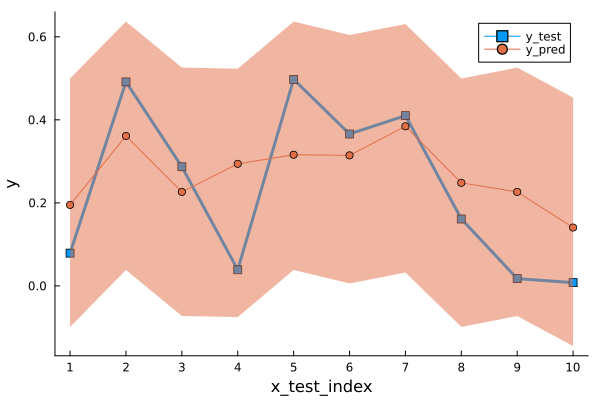

`ConformalPrediction.jl` is a package for Uncertainty Quantification (UQ) through Conformal Prediction (CP) in Julia. It is designed to work with supervised models trained in [MLJ](https://alan-turing-institute.github.io/MLJ.jl/dev/). Conformal Prediction is distribution-free, easy-to-understand, easy-to-use and model-agnostic.

## Installation 🚩

You can install the first stable release from the general registry:

``` julia
using Pkg
Pkg.add("ConformalPrediction")
```

The development version can be installed as follows:

``` julia
using Pkg
Pkg.add(url="https://github.com/pat-alt/ConformalPrediction.jl")
```

## Status 🔁

This package is in its very early stages of development and therefore still subject to changes to the core architecture. The following approaches have been implemented in the development version:

**Regression**:

- Inductive
- Naive Transductive
- Jackknife
- Jackknife+
- Jackknife-minmax
- CV+
- CV-minmax

**Classification**:

- Inductive (LABEL (Sadinle, Lei, and Wasserman 2019))
- Adaptive Inductive

I have only tested it for a few of the supervised models offered by [MLJ](https://alan-turing-institute.github.io/MLJ.jl/dev/).

## Usage Example 🔍

To illustrate the intended use of the package, let’s have a quick look at a simple regression problem. Using [MLJ](https://alan-turing-institute.github.io/MLJ.jl/dev/) we first generate some synthetic data and then determine indices for our training, calibration and test data:

``` julia
using MLJ
X, y = MLJ.make_regression(1000, 2, rng=123)
train, test = partition(eachindex(y), 0.4, 0.4)
```

We then import a decision tree ([`EvoTrees.jl`](https://github.com/Evovest/EvoTrees.jl)) following the standard [MLJ](https://alan-turing-institute.github.io/MLJ.jl/dev/) procedure.

``` julia
EvoTreeRegressor = @load EvoTreeRegressor pkg=EvoTrees
model = EvoTreeRegressor() 
```

To turn our conventional model into a conformal model, we just need to declare it as such by using `conformal_model` wrapper function. The generated conformal model instance can wrapped in data to create a *machine*. Finally, we proceed by fitting the machine on training data using the generic `fit!` method:

``` julia
using ConformalPrediction
conf_model = conformal_model(model)
mach = machine(conf_model, X, y)
fit!(mach, rows=train)
```

Predictions can then be computed using the generic `predict` method. The code below produces predictions for the first `n` samples. Each tuple contains the lower and upper bound for the prediction interval.

``` julia
n = 10
Xtest = selectrows(X, first(test,n))
ytest = y[first(test,n)]
predict(mach, Xtest)
```

    ╭─────────────────────────────────────────────────────────────────╮
    │                                                                 │
    │       (1)   ([-0.09891405785690383], [0.49964732015739516])     │
    │       (2)   ([0.0383072040020363], [0.6368685820163353])        │
    │       (3)   ([-0.07259769821773604], [0.525963679796563])       │
    │       (4)   ([-0.07523241723190383], [0.5233289607823952])      │
    │       (5)   ([0.0383072040020363], [0.6368685820163353])        │
    │       (6)   ([0.005864515060080733], [0.6044258930743798])      │
    │       (7)   ([0.032269819730414595], [0.6308311977447136])      │
    │       (8)   ([-0.09891405785690383], [0.49964732015739516])     │
    │       (9)   ([-0.07259769821773604], [0.525963679796563])       │
    │      (10)   ([-0.14499354446540907], [0.4535678335488899])      │
    │                                                                 │
    │                                                                 │
    ╰──────────────────────────────────────────────────── 10 items ───╯

Here is the plot visualizes the above result, shaded area indicates prediction intervals.




## Contribute 🛠

Contributions are welcome! Please follow the [SciML ColPrac guide](https://github.com/SciML/ColPrac).

## References 🎓

Sadinle, Mauricio, Jing Lei, and Larry Wasserman. 2019. “Least Ambiguous Set-Valued Classifiers with Bounded Error Levels.” *Journal of the American Statistical Association* 114 (525): 223–34.
