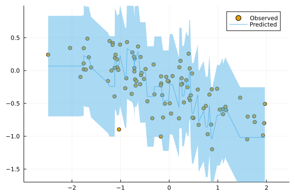
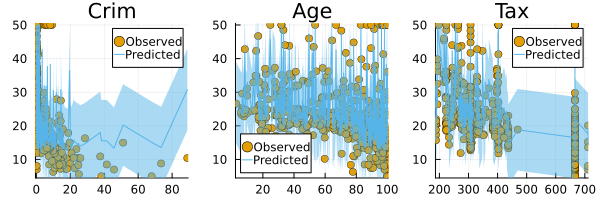

# Visualization using `TaijaPlotting.jl`


``` @meta
CurrentModule = ConformalPrediction
```

This tutorial demonstrates how various custom plotting methods can be used to visually analyze conformal predictors.

``` julia
using ConformalPrediction
using Plots, TaijaPlotting
```

## Regression

### Visualizing Prediction Intervals

For conformal regressors, the `TaijaPlotting.plot` can be used to visualize the prediction intervals for given data points.

#### Univariate Input

``` julia
using MLJ
X, y = make_regression(100, 1; noise=0.3)
```

``` julia
EvoTreeRegressor = @load EvoTreeRegressor pkg=EvoTrees
model = EvoTreeRegressor() 
conf_model = conformal_model(model)
mach = machine(conf_model, X, y)
fit!(mach)
```

``` julia
plot(mach.model, mach.fitresult, X, y; input_var=1)
```



#### Multivariate Input

``` julia
using MLJ
X, y = @load_boston
schema(X)
```

``` julia
EvoTreeRegressor = @load EvoTreeRegressor pkg=EvoTrees
model = EvoTreeRegressor() 
conf_model = conformal_model(model)
mach = machine(conf_model, X, y)
fit!(mach)
```

``` julia
input_vars = [:Crim, :Age, :Tax]
nvars = length(input_vars)
plt_list = []
for input_var in input_vars
    plt = plot(mach.model, mach.fitresult, X, y; input_var=input_var, title=input_var)
    push!(plt_list, plt)
end
plot(plt_list..., layout=(1,nvars), size=(nvars*200, 200))
```



### Visualizing Set Size

To visualize the set size distribution, the `TaijaPlotting.bar` can be used. For regression models, the prediction interval widths are stratified into discrete bins.

``` julia
bar(mach.model, mach.fitresult, X)
```


``` julia
EvoTreeRegressor = @load EvoTreeRegressor pkg=EvoTrees
model = EvoTreeRegressor() 
conf_model = conformal_model(model, method=:jackknife_plus)
mach = machine(conf_model, X, y)
fit!(mach)
```

``` julia
bar(mach.model, mach.fitresult, X)
```


## Classification

``` julia
KNNClassifier = @load KNNClassifier pkg=NearestNeighborModels
model = KNNClassifier(;K=3)
```

### Visualizing Predictions

#### Stacked Area Charts

Stacked area charts can be used to visualize prediction sets for any conformal classifier.

``` julia
using MLJ
n_input = 4
X, y = make_blobs(100, n_input)
```

``` julia
conf_model = conformal_model(model)
mach = machine(conf_model, X, y)
fit!(mach)
```

``` julia
plt_list = []
for i in 1:n_input
    plt = areaplot(mach.model, mach.fitresult, X, y; input_var=i, title="Input $i")
    push!(plt_list, plt)
end
plot(plt_list..., size=(220*n_input,200), layout=(1, n_input))
```


#### Contour Plots for Two-Dimensional Inputs

For conformal classifiers with exactly two input variables, the `TaijaPlotting.contourf` method can be used to visualize conformal predictions in the two-dimensional feature space.

``` julia
using MLJ
X, y = make_blobs(100, 2)
```

``` julia
conf_model = conformal_model(model)
mach = machine(conf_model, X, y)
fit!(mach)
```

``` julia
p1 = contourf(mach.model, mach.fitresult, X, y)
p2 = contourf(mach.model, mach.fitresult, X, y; plot_set_size=true)
plot(p1, p2, size=(700,300))
```


### Visualizing Set Size

To visualize the set size distribution, the `TaijaPlotting.bar` can be used. Recall that for more adaptive predictors the distribution of set sizes is typically spread out more widely, which reflects that “the procedure is effectively distinguishing between easy and hard inputs” (Angelopoulos and Bates 2021). This is desirable: when for a given sample it is difficult to make predictions, this should be reflected in the set size (or interval width in the regression case). Since ‘difficult’ lies on some spectrum that ranges from ‘very easy’ to ‘very difficult’ the set size should vary across the spectrum of ‘empty set’ to ‘all labels included’.

``` julia
X, y = make_moons(500; noise=0.15)
KNNClassifier = @load KNNClassifier pkg=NearestNeighborModels
model = KNNClassifier(;K=50) 
```

``` julia
conf_model = conformal_model(model)
mach = machine(conf_model, X, y)
fit!(mach)
```

``` julia
p1 = contourf(mach.model, mach.fitresult, X, y; plot_set_size=true)
p2 = bar(mach.model, mach.fitresult, X)
plot(p1, p2, size=(700,300))
```


``` julia
conf_model = conformal_model(model, method=:adaptive_inductive)
mach = machine(conf_model, X, y)
fit!(mach)
```

``` julia
p1 = contourf(mach.model, mach.fitresult, X, y; plot_set_size=true)
p2 = bar(mach.model, mach.fitresult, X)
plot(p1, p2, size=(700,300))
```


Angelopoulos, Anastasios N., and Stephen Bates. 2021. “A Gentle Introduction to Conformal Prediction and Distribution-Free Uncertainty Quantification.” <https://arxiv.org/abs/2107.07511>.
