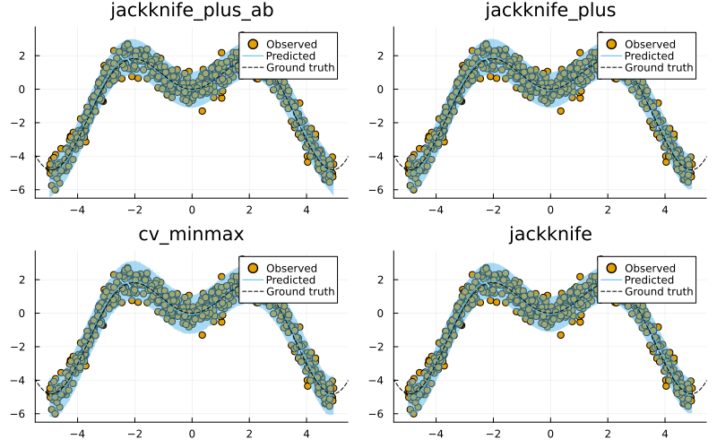
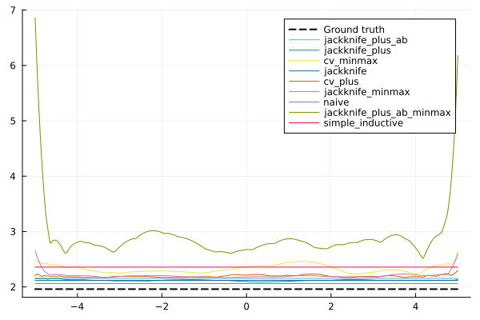

# Regression

This tutorial presents and compares different approaches to Conformal Regression using a simple synthetic dataset. It is inspired by this MAPIE [tutorial](https://mapie.readthedocs.io/en/latest/examples_regression/4-tutorials/plot_main-tutorial-regression.html#).

## Data

We begin by generating some synthetic regression data below:

``` julia
# Regression data:

# Inputs:
N = 600
xmax = 5.0
using Distributions
d = Uniform(-xmax, xmax)
X = rand(d, N)
X = reshape(X, :, 1)

# Outputs:
noise = 0.5
fun(X) = X * sin(X)
ε = randn(N) .* noise
y = @.(fun(X)) + ε
y = vec(y)

# Partition:
using MLJ
train, test = partition(eachindex(y), 0.4, 0.4, shuffle=true)

using Plots
scatter(X, y, label="Observed")
xrange = range(-xmax,xmax,length=N)
plot!(xrange, @.(fun(xrange)), lw=4, label="Ground truth", ls=:dash, colour=:black)
```

## Model

To model this data we will use polynomial regression. There is currently no out-of-the-box support for polynomial feature transformations in `MLJ`, but it is easy enough to add a little helper function for this. Note how we define a linear pipeline `pipe` here. Since pipelines in `MLJ` are just models, we can use the generated object as an input to `conformal_model` below.

``` julia
LinearRegressor = @load LinearRegressor pkg=MLJLinearModels
degree_polynomial = 10
polynomial_features(X, degree::Int) = reduce(hcat, map(i -> X.^i, 1:degree))
pipe = (X -> MLJ.table(polynomial_features(MLJ.matrix(X), degree_polynomial))) |> LinearRegressor()
```

## Conformal Prediction

Next, we conformalize our polynomial regressor using every available approach (except the Naive approach):

``` julia
using ConformalPrediction
conformal_models = merge(values(available_models[:regression])...)
results = Dict()
for _mod in keys(conformal_models) 
    conf_model = conformal_model(pipe; method=_mod, coverage=0.95)
    global mach = machine(conf_model, X, y)
    MLJ.fit!(mach, rows=train)
    results[_mod] = mach
end
```

Finally, let us look at the resulting conformal predictions in each case. The chart below shows the results: for the first 4 methods it displays the training data (dots) overlaid with the conformal prediction interval (shaded area). At first glance it is hard to spot any major differences between the different approaches. Next, we will look at how we can evaluate and benchmark these predictions.

``` julia
using Plots
zoom = -0.5
xrange = range(-xmax+zoom,xmax-zoom,length=N)
plt_list = []

for (_mod, mach) in first(results, n_charts)
    plt = plot(mach.model, mach.fitresult, X, y, zoom=zoom, title=_mod)
    plot!(plt, xrange, @.(fun(xrange)), lw=1, ls=:dash, colour=:black, label="Ground truth")
    push!(plt_list, plt)
end

plot(plt_list..., size=(800,500))
```



## Evaluation

For evaluation of conformal predictors we follow Angelopoulos and Bates (2021) (Section 3). As a first step towards adaptiveness (adaptivity), the authors recommend to inspect the set size of conformal predictions. The chart below shows the interval width for the different methods along with the ground truth interval width:

``` julia
xrange = range(-xmax,xmax,length=N)
plt = plot(xrange, ones(N) .* (1.96*2*noise), ls=:dash, colour=:black, label="Ground truth", lw=2)
for (_mod, mach) in results
    ŷ = predict(mach, reshape([x for x in xrange], :, 1))
    y_size = set_size.(ŷ)
    plot!(xrange, y_size, label=String(_mod))
end
plt
```



We can also use specific metrics like **empirical coverage** and **size-stratified coverage** to check for correctness and adaptiveness, respectively (**angelopoulus2021gentle?**). To this end, the package provides custom measures that are compatible with `MLJ.jl`. In other words, we can evaluate model performance in true `MLJ.jl` fashion (see [here](https://alan-turing-institute.github.io/MLJ.jl/dev/evaluating_model_performance/)).

The code below runs the evaluation with respect to both metrics, `emp_coverage` and `ssc` for a single conformal machine:

``` julia
_mod, mach = first(results)
_eval = evaluate!(
    mach,
    operation=predict,
    measure=[emp_coverage, ssc]
)
display(_eval)
println("Empirical coverage for $(_mod): $(round(_eval.measurement[1], digits=3))")
println("SSC for $(_mod): $(round(_eval.measurement[2], digits=3))")
```

    PerformanceEvaluation object with these fields:
      measure, operation, measurement, per_fold,
      per_observation, fitted_params_per_fold,
      report_per_fold, train_test_rows
    Extract:
    ┌──────────────────────────────────────────────┬───────────┬─────────────┬──────
    │ measure                                      │ operation │ measurement │ 1.9 ⋯
    ├──────────────────────────────────────────────┼───────────┼─────────────┼──────
    │ ConformalPrediction.emp_coverage             │ predict   │ 0.94        │ 0.0 ⋯
    │ ConformalPrediction.size_stratified_coverage │ predict   │ 0.94        │ 0.0 ⋯
    └──────────────────────────────────────────────┴───────────┴─────────────┴──────
                                                                   2 columns omitted

    Empirical coverage for jackknife_plus_ab: 0.94
    SSC for jackknife_plus_ab: 0.94

Note that, in the regression case, stratified set sizes correspond to discretized interval widths.

To benchmark the different approaches, we evaluate them iteratively below. As expected, more conservative approaches like Jackknife-min max  and CV-min max  attain higher aggregate and conditional coverage. Note that size-stratified is not available for methods that produce constant intervals, like standard Jackknife.

``` julia
using DataFrames
bmk = DataFrame()
for (_mod, mach) in results
    _eval = evaluate!(
        mach,
        resampling=CV(;nfolds=5),
        operation=predict,
        measure=[emp_coverage, ssc]
    )
    _bmk = DataFrame(
        Dict(
            :model => _mod,
            :emp_coverage => _eval.measurement[1],
            :ssc => _eval.measurement[2]
        )
    )
    bmk = vcat(bmk, _bmk)
end

show(sort(select!(bmk, [2,1,3]), 2, rev=true))
```

    9×3 DataFrame
     Row │ model                     emp_coverage  ssc      
         │ Symbol                    Float64       Float64  
    ─────┼──────────────────────────────────────────────────
       1 │ jackknife_plus_ab_minmax      0.988333  0.980547
       2 │ cv_minmax                     0.96      0.910873
       3 │ simple_inductive              0.953333  0.953333
       4 │ jackknife_minmax              0.946667  0.869103
       5 │ cv_plus                       0.945     0.866549
       6 │ jackknife_plus_ab             0.941667  0.941667
       7 │ jackknife_plus                0.941667  0.871606
       8 │ jackknife                     0.941667  0.941667
       9 │ naive                         0.938333  0.938333

## References

Angelopoulos, Anastasios N., and Stephen Bates. 2021. “A Gentle Introduction to Conformal Prediction and Distribution-Free Uncertainty Quantification.” <https://arxiv.org/abs/2107.07511>.
